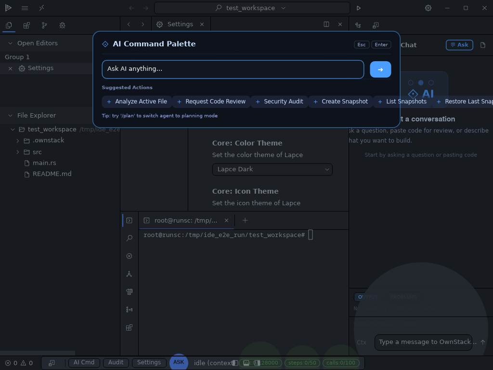

<h1 align="center">
  <a href="https://github.com/psykoniz/Ownstack" target="_blank">
    <br>
    OwnStack IDE
  </a>
</h1>

<h4 align="center">AI-powered native code editor and agent runtime, built on Lapce</h4>

<div align="center">
  <a href="https://github.com/psykoniz/Ownstacklapce/actions/workflows/ci.yml" target="_blank">
    
  </a>
  <a href="https://discord.gg/n8tGJ6Rn6D" target="_blank">
    
  </a>
</div>

OwnStack IDE is a native, GPU-accelerated editor with an integrated secure AI runtime.
It is developed as a Lapce fork and keeps the Rust-native stack (Floem + wgpu).

Current status: Phase 12 complete (`.ownstack/current_phase.json`), now in stabilization.



## Key capabilities

### Editor platform (Lapce base)
- Native Rust UI (Floem), no Electron/Tauri runtime
- Fast text engine and GPU rendering
- Built-in LSP workflow (diagnostics, symbols, actions)
- Terminal, source control, remote workflows, WASI plugin surface

### OwnStack runtime (implemented)
- Agent runtime with mode/state loop (`ask`, `auto`, `plan`)
- Security chain enforcement: `Policy -> Path -> Sandbox -> ToolResult -> Audit`
- Policy approval with correlation IDs and timeout handling
- Onboarding + OS keyring API key storage
- MCP server integration and panel-based management
- E2E control server (`--e2e`, `OWNSTACK_E2E`, `OWNSTACK_WINDOW_SIZE`)
- LSP availability detection with UI notification when missing

## Architecture

Runtime topology:
1. `lapce-app` (UI)
2. `lapce-proxy` (dispatch/process bridge)
3. `ownstack-agent` (orchestration/tool execution)
4. Optional bridge path: `ownstack-bridge -> ownstack-python`

Mandatory execution chain for tools:

`Command -> PolicyEngine -> PathValidator -> Sandbox -> ToolResult -> AuditLog`

## Quick start

### Build and run
```bash
git clone https://github.com/psykoniz/Ownstacklapce.git
cd Ownstacklapce
cargo build --release -p lapce-app --bin ownstack-ide
./target/release/ownstack-ide
```

### Run baseline checks
```bash
cargo check --workspace --all-targets
cargo test -p ownstack-agent
cargo test -p ownstack-engine
cargo test -p lapce-app ownstack_tests
python scripts/healthcheck.py
```

## Documentation

- [Architecture](docs/ARCHITECTURE.md)
- [Roadmap](docs/ROADMAP.md)
- [Operations](docs/OPERATIONS.md)
- [Build from source](docs/building-from-source.md)
- [Install from packages](docs/installing-with-package-manager.md)
- [E2E scripts](tests/e2e/README.md)
- [Agent directives](GEMINI.md)

## Security model

| Layer | Responsibility |
|---|---|
| PolicyEngine | Classify command risk (`auto`, `ask`, `blocked`) |
| PathValidator | Restrict operations to allowed workspace paths |
| Sandbox | Execute commands in constrained runtime |
| AuditLogger | Persist traceable JSONL events |

## Contributing

See [CONTRIBUTING.md](CONTRIBUTING.md) and [AGENTS.md](AGENTS.md).

## License

Dual license model:
- `lapce-*` core: Apache 2.0 (`LICENSE`)
- `ownstack-*` additions: MIT (`LICENSE-OWNSTACK`)
