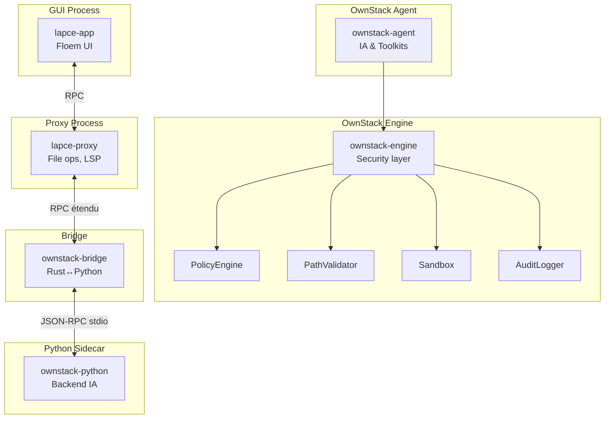

# OwnStack Native IDE — Architecture Document

> **Version**: 1.1  
> **Dernière mise à jour**: 9 février 2026  
> **Statut**: Phase 4 — Distribution (Installers & Bundling)

---

## 1. Vue d'ensemble

OwnStack Native IDE est un fork de [Lapce](https://github.com/lapce/lapce), un éditeur de code écrit en Rust avec une interface native GPU-accélérée. Notre objectif est d'intégrer des capacités d'agents IA sécurisés directement dans l'IDE.

### 1.1 Principes fondamentaux

| Principe | Description |
|----------|-------------|
| **Rust-first** | Tout le code critique est en Rust, pas de runtime JS/Electron |
| **GPU natif** | Rendu via wgpu, interface via Floem |
| **Sécurité par défaut** | Policy Engine, Path Validation, Sandbox obligatoires |
| **Phases séquentielles** | Développement structuré en 5 phases |

### 1.2 Ce que nous héritons de Lapce

- Text buffer Xi Rope (performant, memory-efficient)
- Rendu GPU wgpu
- Interface Floem (Rust natif)
- Système LSP intégré
- Plugin system WASI
- Architecture multi-process (app + proxy)

---

## 2. Structure du monorepo

```
ownstack-ide/
├── Cargo.toml                  # Workspace Rust
├── LICENSE                     # Apache 2.0 (Lapce) — NE PAS MODIFIER
├── LICENSE-OWNSTACK            # MIT (composants OwnStack)
├── NOTICE                      # Attribution
├── GEMINI.md                   # Directives agent IA
├── AGENTS.md                   # Directives Codex
│
│── CRATES LAPCE (hérités) ─────────────────────────────
├── lapce-app/                  # GUI principale (Floem)
├── lapce-core/                 # Core editor (Xi Rope, Tree-sitter)
├── lapce-proxy/                # Proxy process (LSP, fichiers)
├── lapce-rpc/                  # Protocole RPC interne
│
│── CRATES OWNSTACK (nouveaux) ─────────────────────────
├── ownstack-engine/            # ★ Sécurité (Phase 1)
├── ownstack-agent/             # ★ Agent IA (Phase 2)
├── ownstack-bridge/            # ★ Bridge Rust↔Python (Phase 1)
│
│── BACKEND PYTHON ─────────────────────────────────────
├── ownstack-python/            # Sidecar Python (Phase 1)
│
│── CONFIGURATION ──────────────────────────────────────
├── .ownstack/
│   ├── current_phase.json      # Phase actuelle
│   └── budgets.json            # Limites d'exécution agent
│
└── docs/
    └── ARCHITECTURE.md         # CE FICHIER
```

---

## 3. Architecture des composants

### 3.1 Vue des crates Rust



### 3.2 Flux d'exécution sécurisé

Toute commande IA suit ce flux **obligatoire** :

```
[Entrée utilisateur] 
       │
       ▼
[1] PolicyEngine.evaluate() 
       │
       ├─ Blocked → STOP + audit
       ├─ Ask → Prompt UI → (approve/deny)
       └─ Auto → continue
       │
       ▼
[2] PathValidator.validate()
       │
       ├─ Hors workspace → STOP + audit
       └─ OK → continue
       │
       ▼
[3] Sandbox.exec()
       │
       ▼
[4] ToolResult
       │
       ▼
[5] AuditLogger.log()
       │
       ▼
[Retour GUI]
```

---

## 4. Crates OwnStack — Spécifications

### 4.1 ownstack-engine (Phase 1)

**Responsabilité** : Couche de sécurité pour toutes les opérations IA.

| Module | Description |
|--------|-------------|
| `policy.rs` | Évalue les commandes (Auto/Ask/Blocked) |
| `path_safety.rs` | Valide les chemins (dans workspace uniquement) |
| `audit.rs` | Journalise toutes les actions (JSONL) |
| `sandbox/` | Isole l'exécution des commandes |
| `tool_result.rs` | Structure de retour standardisée |

**Dépendances** :
```toml
[dependencies]
serde = { version = "1", features = ["derive"] }
serde_json = "1"
chrono = { version = "0.4", features = ["serde"] }
thiserror = "1"
tokio = { version = "1", features = ["full"] }
tracing = "0.1"
regex = "1"
```

### 4.2 ownstack-agent (Phase 2)

**Responsabilité** : Agent IA avec toolkits intégrés.

| Module | Description |
|--------|-------------|
| `provider.rs` | Trait LlmProvider |
| `providers/` | Implémentations (OpenRouter, Anthropic, Ollama) |
| `context.rs` | Gestion de la fenêtre de contexte |
| `toolkits/` | Outils (exec, read, write, LSP, MCP) |
| `orchestrator.rs` | Multi-agent (Phase 3) |

### 4.3 ownstack-bridge (Phase 1)

**Responsabilité** : Communication Rust ↔ Python via JSON-RPC stdio.

---

## 5. Protocole RPC étendu

### 5.1 Messages OwnStack (Phase 1)

```rust
pub enum OwnStackRpcMessage {
    // GUI → Agent
    AiPrompt { prompt: String, context: ContextData },
    ToolExec { tool: String, args: serde_json::Value },
    PolicyOverride { action: String, approved: bool },
    
    // Agent → GUI
    AiStreamChunk { content: String, done: bool },
    PolicyPrompt { action: String, description: String },
    AuditEvent { entry: AuditEntry },
    ToolResultMsg { result: ToolResult },
}
```

### 5.2 Flux RPC

```
lapce-app (GUI)
     │
     │ 1. OwnStackRpcMessage via lapce-rpc
     ▼
lapce-proxy
     │
     │ 2. Dispatch vers OwnStack handler
     ▼
ownstack-bridge
     │
     │ 3. JSON-RPC stdio
     ▼
ownstack-python (sidecar)
     │
     │ 4. ToolResult JSON
     ▼
[Retour inverse]
```

---

## 6. Roadmap par phases

### Phase 0 — Fork & Rebrand (Semaines 1-3) ✅ EN COURS

| Tâche | Statut |
|-------|--------|
| Fork GitHub | ⬜ |
| Renommer binaire → `ownstack-ide` | ⬜ |
| Fichiers LICENSE, NOTICE | ⬜ |
| GEMINI.md, AGENTS.md | ✅ |
| Modifier titre fenêtre | ⬜ |
| CI GitHub Actions | ⬜ |
| README.md | ⬜ |

### Phase 1 — OwnStack Embedded (Semaines 4-10)

- Créer `ownstack-engine/`
- Créer `ownstack-bridge/`
- Copier `ownstack-python/` depuis commit référence
- Étendre RPC avec messages OwnStack
- Ajouter panels IA dans GUI
- Tests unitaires et E2E

### Phase 2 — Agents IA Natifs (Semaines 11-18)

- Créer `ownstack-agent/`
- Porter Healer et Multivers en Rust
- Streaming UI
- Sandbox process natif (sans Docker)
- Mission system basique

### Phase 3 — MCP & Plugins (Semaines 19-26)

- Client MCP natif Rust
- Serveur MCP exposant tools OwnStack
- Plugin system WASI étendu
- Multi-agent (Planner + Critic + Worker)

### Phase 4 — Distribution (Semaines 27-32)

- Installers (deb, rpm, dmg, msi)
- Auto-updater
- Onboarding wizard
- Release v0.1.0

---

## 7. Sécurité — Résumé

### 7.1 Policy Engine

| Catégorie | Exemples | Décision |
|-----------|----------|----------|
| **Blocked** | `rm -rf /`, `sudo *`, `curl \| sh` | Toujours refusé |
| **Ask** | `git push`, `docker rm`, réseau | Confirmation requise |
| **Auto** | Lecture workspace, `cargo build`, tests | Autorisé |

### 7.2 Path Validation

- `canonicalize()` obligatoire
- Doit commencer par `workspace_root`
- Symlinks résolus avant validation
- `../` → Rejet immédiat

### 7.3 Sandbox

- `env_clear()` : Aucune variable héritée
- `timeout` : 300s par défaut
- Pas d'accès réseau par défaut
- Pas de sudo

### 7.4 Audit

Toute action est journalisée dans `.ownstack/audit.jsonl` :

```json
{
  "timestamp": "ISO8601",
  "action": "exec|read|write|delete",
  "command": "...",
  "policy_decision": "Auto|Ask|Blocked",
  "success": true,
  "paths_accessed": ["..."]
}
```

---

## 8. Standards de code

### 8.1 Rust

```yaml
edition: "2021"
format: rustfmt
lints: [clippy::all, clippy::pedantic]
erreurs: thiserror
interdit: [unwrap() prod, panic!() prod, println!()]
async: tokio
serialisation: serde + serde_json
logging: tracing
```

### 8.2 Python (ownstack-python/)

```yaml
version: "3.11+"
framework: FastAPI
format: black + isort
tests: pytest
```

---

## 9. Fichiers référence

| Fichier | Description |
|---------|-------------|
| `GEMINI.md` | Directives agent — SOURCE DE VÉRITÉ |
| `AGENTS.md` | Directives Codex (dérivé) |
| `.ownstack/current_phase.json` | Phase actuelle du projet |
| `.ownstack/budgets.json` | Limites d'exécution agent |

---

## 10. Liens et ressources

- **Lapce original** : https://github.com/lapce/lapce
- **OwnStack source** : https://github.com/psykoniz/Ownstack (commit f6c2d2c)
- **Floem UI** : https://github.com/lapce/floem
- **wgpu** : https://wgpu.rs/

---

*Ce document est synchronisé avec GEMINI.md v1.1*
